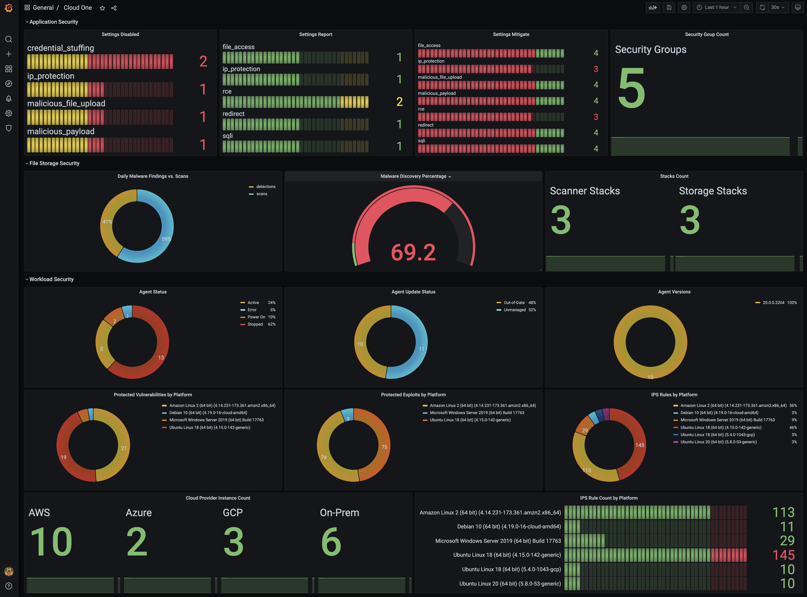

# api-collector

- [api-collector](#api-collector)
  - [About](#about)
    - [Collector Template](#collector-template)
  - [Quick Start](#quick-start)
  - [Example Queries](#example-queries)
  - [Tricks](#tricks)

## About

Generic API-Collector implemented as a Custom Collector for Prometheus. It supports pluggable collectors and updates at runtime! For this initial version, CounterMetrics are the only metrics supported.

A sample collector to calculate the sky quality forecast for stargazing is provided together with example collectors for Workload Security, File Storage and Application Security.



### Collector Template

Below, a collector template is shown. They must all be located inside the `collectors-enabled` directory to be deployed.

> Note: If you follow the Prometheus configuration shown below, you need to ensure that a full collector run does not take longer than 30s, since the `scrape_timeout` is set to this timeout.

The general structure of a collector is as shown below:

```py
def collect() -> dict:

    url=open('/etc/mysecrets/url', 'r').read()
    secret=open('/etc/mysecrets/secret', 'r').read()

    # Define your metrics here
    result = {
        "CounterMetricFamilyName": "myname",
        "CounterMetricFamilyHelpText": "myhelp",
        "CounterMetricFamilyLabels": ['attribute1', 'attribute2'],
        "Metrics": []
    }

    # Do your API query
    url = "https://" + url
    data = {}
    post_header = {
        "Content-type": "application/json",
        "api-secret-key": secret,
        "api-version": "v1",
    }
    response = requests.get(
        url, data=json.dumps(data), headers=post_header, verify=True
    ).json()

    # Error handling
    # ...

    # Calculate your metrics
    if len(response[]) > 0:
        for item in response[]:
            # Do some calculations
            # ...

            labels = []
            labels.append(str(attribute1))
            labels.append(str(attribute2))
            metric = calculated_result

            # Add a metric
            result['Metrics'].append([labels, metric])

    # Return results
    _LOGGER.debug("Metrics collected: {}".format(result))
    return result
```

Within the repo, the following collectors are provided as examples:

- `astroweather.py` - calculates the night sky quality of the night sky (might be useful for stargazers)
- `ws_ips.py` - calculates metrics for IPS module of Workload Security
- `fss_statistics.py` - gathers some statistical data from File Storage Security
- `as_settings.py` - queries the security seetings of Application Security groups

Within the repo is a `dashboard.json` which you can import to your Grafana instance.
## Quick Start

> This quick start uses Workload Security as an example.

1. Create a config.json

    ```sh
    cp config.json.sample config.json
    ```

    and adapt it to your environment

2. Configure the overrides for your Prometheus deployment to query the api-collector. In a default Prometheus installation, the api-collector and it's components need to run within the prometheus namespace.

    ```yaml
    prometheus:
      prometheusSpec:
        additionalScrapeConfigs:
        - job_name: api-collector
          scrape_interval: 60s
          scrape_timeout: 30s
          scheme: http
          metrics_path: /
          static_configs:
          - targets: ['api-collector:8000']
    ```

    Below, an example for a full deployment is shown. For simplicity, you can use the [c1-playground](https://github.com/mawinkler/c1-playground) and run the script `deploy-prometheus-grafana.sh` after you provisiond the cluster with `up.sh`.
    
    If you want to deploy Prometheus and Grafana manually, execute the following steps to deploy both on your cluster.

    ```sh
    kubectl create namespace prometheus --dry-run=client -o yaml | kubectl apply -f -

    cat <<EOF >overrides/overrides-prometheus.yml
    grafana:
      enabled: true
      adminPassword: operator
      service:
        type: LoadBalancer
    prometheusOperator:
      enabled: true
      service:
        type: LoadBalancer
    prometheus:
      enabled: true
      service:
        type: LoadBalancer
      prometheusSpec:
        additionalScrapeConfigs:
        - job_name: api-collector
          scrape_interval: 60s
          scrape_timeout: 30s
          scheme: http
          metrics_path: /
          static_configs:
          - targets: ['api-collector:8000']
    EOF

    helm repo add prometheus-community https://prometheus-community.github.io/helm-charts
    helm repo add stable https://charts.helm.sh/stable
    helm repo update

    helm upgrade \
      prometheus \
      --values overrides/overrides-prometheus.yml \
      --namespace prometheus \
      --install \
      prometheus-community/kube-prometheus-stack
    ```

3. Run Deploy to deploy the api-collector

    ```sh
    ./deploy.sh
    ```

4. The Workload Security collectors do require a secret to work properly. Create it with

    ```sh
    NAMESPACE="$(jq -r '.namespace' config.json)"
    WS_URL="$(jq -r '.ws_url' config.json)"
    C1_URL="$(jq -r '.c1_url' config.json)"
    WS_API_KEY="$(jq -r '.ws_api_key' config.json)"

    # create workload security secret
    kubectl -n ${NAMESPACE} create secret generic workload-security \
        --from-literal=ws_url=${WS_URL} \
        --from-literal=c1_url=${C1_URL} \
        --from-literal=api_key=${WS_API_KEY} \
        --dry-run=client -o yaml | kubectl apply -f -

    # create workload security secret volume mount
    kubectl -n ${NAMESPACE} patch deployment api-collector --patch "
    spec:
      template:
        spec:
          containers:
            - name: api-collector
              volumeMounts:
              - name: workload-security-credentials
                mountPath: "/etc/workload-security-credentials"
          volumes:
            - name: workload-security-credentials
              secret:
                secretName: workload-security
    "
    ```

5. Now, inject the sample collectors to the running api-collector

    ```sh
    ./deploy-collectors.sh
    ```

You should now be able to query prometheus with `PromQL`.

## Example Queries

Query the amount of instances within the major public clouds

```PromQL
sum(ws_ips_total{arribute="info"}) by (cloud_provider)
```

Query the amount of protected exploits by grouping to the platform

```PromQL
sum(ws_ips_total{arribute="type_exploit"}) by (platform) != 0
```

Query the amount of assigned ips rules by platform

```PromQL
sum(ws_ips_total{arribute="rule_count"}) by (platform) != 0
```

Calculate the percentage of malware detections by FSS scans

```PromQL
sum(fss_statistics_total{statistic="detections"}) / sum(fss_statistics_total{statistic="scans"}) * 100
```

## Tricks

Quick shell in the cluster

```sh
kubectl run -it -n prometheus --image=ubuntu ubuntu --restart=Never --rm -- /bin/bash

# in the new shell, execute e.g.
apt update && apt install -y curl
curl http://api-collector:8000
```

Jump into the api-collector

```sh
kubectl exec -it -n prometheus $(kubectl -n prometheus get pods -o json | jq -r '.items[].metadata | select(.name | startswith("api-collector")) | .name') -- /bin/sh
```

Logs of the api-collector

```sh
kubectl -n prometheus logs -f $(kubectl -n prometheus get pods -o json | jq -r '.items[].metadata | select(.name | startswith("api-collector")) | .name')
```
